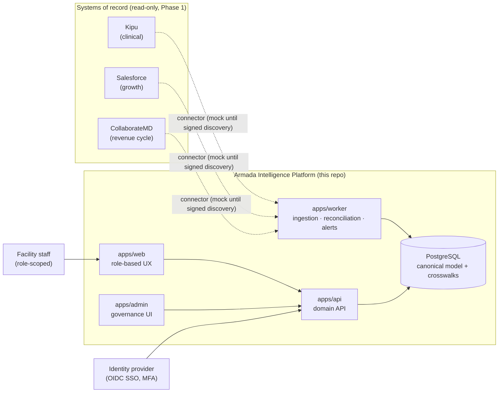

# Architecture Overview

Status: Epics 1–5 and 9–14 complete. Epics 6–8 (real vendor read
connectors) remain blocked on signed vendor discovery, and two governance
inputs remain open: the legally approved Part 2 consent matrix (ADR-0014)
and real metric targets/SLAs. The authoritative specification is
[`../BUILD_BLUEPRINT.md`](../BUILD_BLUEPRINT.md); the live API surface is
in [`../api/endpoints.md`](../api/endpoints.md).

## System context

The Armada Excellence System (AES — Gold Standards, lineups, rounding, role
cards) must remain deployable on paper without any of the boxes above; AIP
accelerates it but never gates it.

## Monorepo boundaries

- `apps/*` — deployable units only; no business logic in UI, no logic in
  entrypoints beyond wiring.
- `packages/*` — shared libraries. Domain rules will live in
  `packages/domain` (future), never in vendor adapters or UI.
- Vendor adapters (`packages/connector-*`, future) map vendor payloads to
  canonical envelopes and nothing else. They are read-only by default and
  mock-only until signed vendor discovery lands in `docs/integrations/`.
- Cross-package imports go through workspace package boundaries
  (`@armada/...`), compiled with TypeScript project references.

## What exists after Epic 1

| Piece | Where | Notes |
|---|---|---|
| Strict TS + project references | `packages/config/tsconfig.base.json` | ADR-0004 |
| Env validation | `packages/env` | fail-fast, secret-redacting; ADR-0005 |
| Feature flags | `packages/feature-flags` | default off; high-risk locked in prod; ADR-0005 |
| PHI-safe logging | `packages/observability` | deny-list redaction, JSON lines; ADR-0005 |
| Audit log | `packages/audit` | append-only, hash-chained; ADR-0007 |
| Identity & access | `packages/auth` | PBAC engine, sessions, dev IdP, break-glass, access review; ADR-0006 |
| Authorization model | [`../security/authorization-model.md`](../security/authorization-model.md) | roles, matrix, reason codes |
| Excellence content | `packages/excellence` | versioned Gold Standards / role cards / policies / constitution, approval workflow, search, printable + offline exports; ADR-0008 |
| Work management | `packages/work` | work items with provenance, role ownership, escalation ladder, resolution codes, PHI-free notifications; ADR-0009 |
| Integration framework | `packages/integrations-core` | §12 connector SDK, canonical envelope, idempotent pipeline (quarantine, DLQ, cursors, reconciliation, anomaly alerts); ADR-0010 |
| Mock connectors | `packages/connector-{kipu,salesforce,collaboratemd}` | synthetic read-only mocks; real adapters forbidden until signed discovery |
| Identity resolution | `packages/identity` | deterministic-only auto-linking, crosswalks, human review queue, dual-confirmed merge + audited unmerge; ADR-0011 |
| Metrics | `packages/metrics` | governed metric registry, provenance-bearing observations, scorecards with honest no_data, CSV export; ADR-0012 |
| Daily lineup | `packages/lineup` | generated + human sections, degrade-per-section, approve/publish, printable; ADR-0013 |
| Consent | `packages/consent` | §10 directive model + fail-closed decision service (no Part 2 ALLOW without approved legal matrix); ADR-0014 |
| Compliance | `packages/compliance` | requirement registry, evidence, corrective actions, tracer readiness; ADR-0015 |
| Web workspaces | `apps/web` | dependency-free server-rendered role pages over the API; ADR-0016 |
| API skeleton | `apps/api` | health/readiness + authenticated Epic 2 routes (me, facilities, patient summary, audit events, break-glass, access review) + Epic 3 Excellence library and authoring routes + Epic 4 work queues and notifications |
| Worker skeleton | `apps/worker` | interval scheduler seam; takes over ingestion/sweeps with the database epic |
| Admin stub | `apps/admin` | reserved; governance surfaces currently live in the web app + API |
| CI | `.github/workflows/ci.yml` | format, secrets, typecheck, tests, env schema, audit |
| Dev environment | `.devcontainer/`, `infrastructure/docker/` | Node 22 + Postgres 16 + Redis 7 |
| Repo checks | `scripts/` | dependency-free format/secret/env gates |

## Epic roadmap (blueprint §27)

1. **Foundation** ✅
2. **Identity and access** ✅ — OIDC abstraction + dev IdP, PBAC policy
   engine, sessions with immediate revocation, break-glass, access review.
   Real OIDC SSO (Entra ID + MFA) remains open pending tenant setup and a
   library ADR.
3. **Excellence content** ✅ — versioned/approved Gold Standards, role
   cards, policies, constitution; search; printable + offline exports.
   Admin authoring UI arrives with the web app (Epic 10 framework decision).
4. **Work management** ✅ — role-owned queues, due dates, overdue
   escalation ladder, resolution codes, PHI-free notifications. Per-rule
   escalation policies arrive with the rules engine.
5. **Integration framework** ✅ — connector SDK, canonical envelope, mock
   connectors, idempotent ingestion, quarantine/dead-letter, cursors,
   reconciliation with volume-anomaly work items.
6–8. Vendor read connectors — **only after signed discovery documents.**
9. **Identity resolution** ✅ — crosswalks, deterministic-only auto-link
   rules with hard-conflict veto, human review queue, dual-confirmed
   merge and audited unmerge. (Built ahead of 6–8, which await vendor
   discovery.)
10. **Role workspaces** ✅ — server-rendered role-aware pages (home/my
    work, scorecard, lineup, library, identity review, compliance,
    integrations); rich client deferred (ADR-0016).
11. **Daily lineup** ✅ — generated facts + human sections, approval,
    publication, printable view; survives source outages.
12. **Metrics** ✅ — governed registry, calculation service with
    provenance, executive scorecard computed from live synthetic sources,
    CSV export. Real targets and freshness SLAs await governance + vendor
    discovery.
13. **Privacy/consent** ✅ (fail-closed stub) — directive model, §10.2
    decision shape, auth-engine integration; Part 2 ALLOW impossible until
    counsel approves the decision matrix.
14. **Compliance readiness** ✅ — requirement registry, evidence,
    corrective actions, audit calendar, readiness rollup.

Remaining before Phase 1 acceptance (§28): Epics 6–8 after signed vendor
discovery; real OIDC SSO + MFA (ADR-0006); durable PostgreSQL storage
behind the existing service contracts; the approved consent matrix; and
the production-readiness gate items (§35).

Each epic starts with an ADR + checklist and ends with `npm run verify` green
and a completion report.
