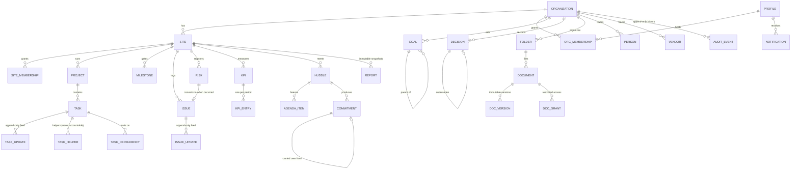
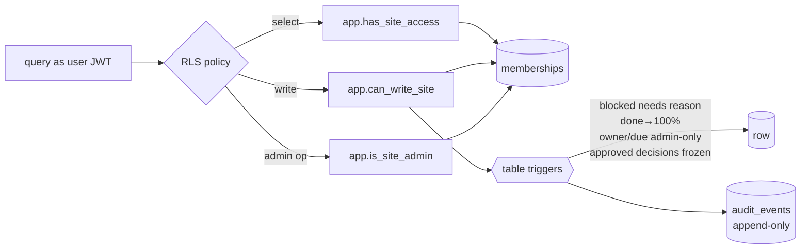

# EverTide OS — Architecture

## Stack

- **Next.js 14 App Router** — server components for reads, server actions +
  route handlers for writes, client components only where interaction or
  Realtime demands it.
- **Supabase** — Postgres (schema, triggers, RPCs), Auth (magic links),
  Realtime (postgres_changes), Storage (private bucket).
- **Enforcement layering** — every write is validated three times:
  1. Client UX (required fields, disabled buttons)
  2. Server action (Zod payload validation + role check + rate limit)
  3. Database (RLS policies, CHECK constraints, triggers) — final authority

## Object model



Every actionable object carries exactly one `owner_id` (single DRI, §2.1).
Business records have `archived_at` — they are never hard-deleted; only
`notifications` support delete.

## Permission model

Roles: `org_admin` > `site_admin` > `member` > `viewer`.

- Membership lives in `organization_memberships` (base role) and
  `site_memberships` (per-site access + optional `role_override`). A profile
  row alone grants nothing.
- Effective site role = `org_admin` everywhere in the org for org admins,
  else `coalesce(site.role_override, org.role)` when an *active* site
  membership exists.
- RLS helper functions (schema `app`, SECURITY DEFINER, not API-exposed):
  `org_role`, `site_role`, `has_site_access`, `is_site_admin`,
  `can_write_site`, `can_read_scoped`/`can_write_scoped` (org-level rows with
  `site_id = null` read org-wide, write org-admin-only), `can_read_document`
  (adds confidentiality + grants).



What each role can do (§5): admins manage config, membership, owners/dates,
archive/restore, KPI definitions, folders, report finalization; members
read everything in their sites and write updates/comments/issues/risks/
decisions/commitments plus status/percent/notes/blockers and their own KPI
entries; viewers read only.

## Important workflows

### Task status transition

```mermaid
sequenceDiagram
    participant U as User (Kanban drag)
    participant SA as Server action
    participant PG as Postgres
    U->>SA: changeTaskStatus(taskId, blocked, reason)
    SA->>SA: Zod + role + rate limit (reason required for blocked)
    SA->>PG: update tasks …
    PG->>PG: tasks_guard (BEFORE): admin rules, done→100%, staleness clock
    PG->>PG: CHECK: blocked ⇒ nonblank reason
    PG->>PG: tasks_log_changes (AFTER): task_updates row + audit_events row
    PG-->>SA: ok / raise
    SA-->>U: toast + refresh; Realtime pushes to other viewers
```

### Huddle lifecycle (§6.9)

```mermaid
stateDiagram-v2
    [*] --> draft: create for Tuesday
    draft --> in_progress: start_huddle() RPC —\ngenerates agenda rows:\nmissing KPIs → critical path → overdue →\nblocked → stale → issues → risks → prior commitments
    in_progress --> in_progress: live updates, dispositions,\nnew commitments, carry_commitment()
    in_progress --> completed: end_huddle() RPC —\nfails if any prior commitment open;\nfreezes agenda_snapshot JSON
    completed --> [*]: immutable, printable
```



`carry_commitment` creates a linked child (`source_commitment_id`,
`carry_count + 1`) on the new huddle and marks the original `carried_over` —
lineage is never lost.

### Decision immutability (§6.7)

`proposed` → free editing → `approve_decision()` (admin RPC) freezes
substance via the `decisions_guard` trigger. Afterward only implementation
status, effective/review dates, and outcome may change. Escape hatches:
`supersede_decision()` (new decision linked via `supersedes_decision_id`) and
`admin_correct_decision()` (transaction-scoped GUC bypass + mandatory reason
written to `audit_events`).

### Documents (§6.10)

Create metadata → server upload route validates session, size, MIME →
service role writes the object to the private bucket at
`{org}/{site|org}/{document}/{uuid}-{name}` → `add_document_version()` RPC
(as the user, so RLS authorizes) registers the immutable version and points
`current_version_id` at it. Download route: user session must *see* the
version row (RLS covers folders, confidentiality, grants) before the service
role mints a 60-second signed URL. Client tokens have zero storage policies.

### Reports (§6.12)

`buildReportSnapshot()` collects everything (scorecard + trends, exceptions,
issues, risks, decisions, commitments, milestones, opening-risk commentary;
monthly adds goals, budget/runway, recurring defects, repeated carryovers,
workstream summaries) into one JSON document stored on the row. Finalization
flips `status = 'final'`; the `report_guard` trigger then rejects every
subsequent update. Rendering reads only the snapshot.

### Opening-risk banner (§7.1)

`computeOpeningRisk` (pure, unit-tested) fires on: critical task blocked or
overdue · milestone at_risk/missed · go/no-go gate pending past its target ·
manual admin declaration (reason required, audited). The `(app)` layout
evaluates it on every request, so the banner is global.

## Realtime

`supabase_realtime` publication carries tasks, task_updates, issues,
issue_updates, kpi_entries, huddles, huddle_commitments, decisions,
notifications. Client components subscribe and call `router.refresh()` so
the server re-renders with RLS applied — payloads are never trusted for
authorization. Optimistic UI exists only where rollback is trivial (Kanban
status override reverts on failure).

## Performance

- Indexes on tenant scope, owner, status, due date, archived state, period
  start (see migrations 0002/0003).
- Feeds, audit, and documents paginated/limited; dashboard batches all reads
  in one `Promise.all` per request.
- Server components render initial data; client bundles stay small (87 kB
  shared baseline).
